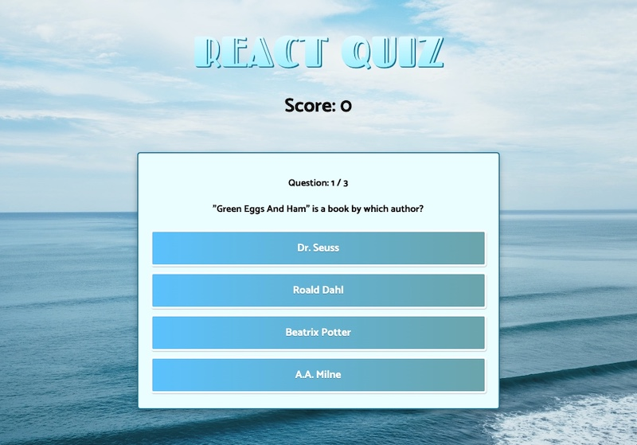

# React/TypeScript Quiz App

[https://react-typescript-quiz-app.herokuapp.com/](https://react-typescript-quiz-app.herokuapp.com/)

## Description
以下の動画を参考に作った学習用リポジトリです。

[「React / Typescript Tutorial - Build a Quiz App」](https://youtu.be/F2JCjVSZlG0) by [freeCodeCamp.org](https://www.youtube.com/c/Freecodecamp)

上記の動画でクイズアプリを作成しており、オリジナルでレベル選択機能を追加実装しました。

## Technologies

- React v18
- TypeScript v4
- styled-components v5

## Set up

```
cd youtube_react_quiz
yarn install
yarn start
```

## Capture



